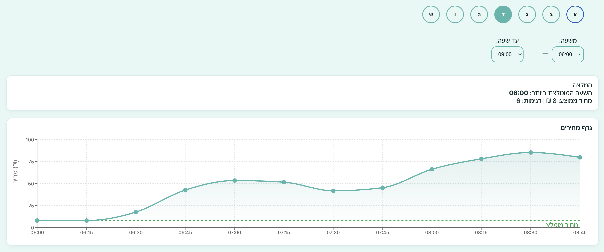

# Fastlane Price Tracker
## 🎯 Overview

An intelligent pricing analysis tool that helps users optimize their travel costs by identifying the most cost-effective times to use the Fastlane toll road service.

**🌐 Live Application**: [Fest Line Traker](https://fest-line-traker.netlify.app/)

---

## 🚀 Key Features

| Feature | Description |
|---------|-------------|
| 📅 Day Selection | Choose any day of the week |
| ⏰ Time Range | Custom hour ranges |
| 💡 Smart Recommendations | Algorithm finds cheapest slots |
| 📊 Visual Analytics | Interactive price charts |
| 📱 Responsive Design | Works on all devices |
| 🌍 RTL Support | Full Hebrew language support |

---

## 🏗️ Architecture
```
┌─────────────┐         ┌──────────────┐         ┌─────────────────┐
│   React     │ ──HTTP──│  Flask API   │ ──SQL── │  PostgreSQL     │
│  (Netlify)  │         │  (Railway)   │         │  (Neon Console) │
└─────────────┘         └──────────────┘         └─────────────────┘
```

### Technology Stack

**Frontend**
- React 19.2.0
- Vite 7.2.4
- Recharts 3.5.1

**Backend**
- Flask + Gunicorn
- PostgreSQL 15
- Python 3.11

---

## 📈 Project Status

- ✅ MVP Complete
- ✅ Deployed to Production
- 🔄 Post-MVP Features (Planned):
  - User authentication
  - Email notifications
  - Siri shortcuts integration
  - Advanced analytics

---

## 🔐 Environment Requirements

This project requires private API credentials:
- Database connection string
- Weather API key
- CORS configuration

**For this reason, the live demo is the primary way to experience this application.**

---

## 📸 Preview



---

## 📜 License

© 2025 - Private Project. All rights reserved.